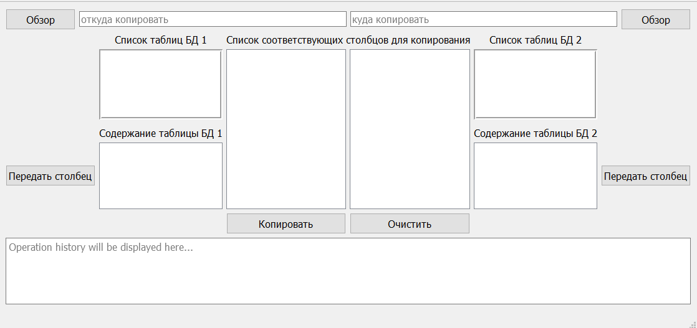

# DatabaseCopyingUtility
This is an instrument developed to make copying data from one database to another quick and easy

Now you can easily move data from one .db file to another without any default SQL clients
## How do i do this?
1) Click browse buttons in application and choose SQLite database files via dialog window 
2) Choose table 
3) Choose column you want to move
4) Press copy button 
5) ~~Relax :)~~ 

If you made a mistake choosing column just click clear button! Now you can ~~enjoy your life~~ continue your ~~boring~~ work c:
        
        
Screenshots provide will provide you with the general look of this application

# Please notice
This app is still in development, copying/clearing will be unavailiable until next week, other features work just fine

# Built With
- [Qt](http://www.qt.io/) - user interface and internal logic
- [SQLite Maestro](https://www.sqlmaestro.com/products/sqlite/maestro/) - used to create a database for this project

- Qt documentation - [click this link](http://doc.qt.io/)

# Getting started
These instructions will get you a copy of the project up and running on your local machine for development and testing purposes. See deployment for notes on how to deploy the project on a live system.
This application requires SQLite client(e.g. SQLite Maestro).

## Installing
Create new database with instructions above or just use '.db' file from this repository.
Download and run Qt Creator, download this project, then open '.pro' file, setup your project. 
In your project change path to '.db' file to match the directory you store the database in.
Now you're ready to go!

# Authors
- Dmitry Petukhov - Initial work/founder

# Acknowledgments
  - You can help me to develop this program or to make it better for your puproses 
  - Feel free to make it look the way you like
 
